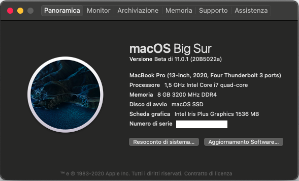
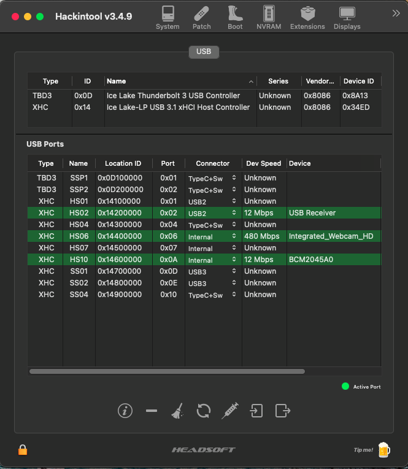

# Dell Vostro 5401 (Ice Lake) Hackintosh

EFI for Dell Vostro 5401 with OpenCore bootloader

### Computer Spec:

| Component        | Brank                              |
| ---------------- | ---------------------------------- |
| CPU              | Intel i7 1065G7 (4C-8T 8MB ICL)    |
| iGPU             | Intel® Iris Plus Graphics          |
| Lan              | Realtek 8168                       |
| Audio            | Realtek ALC236                     |
| Ram              | 8 Gb DDR4 3200 Mhz                 |
| Wifi + Bluetooth | BCM943602BAED (DW1830)             |
| NVMe             | HYNIX BC511 512 GB (WINDOWS)       |
| NVME             | SAMSUNG 970 EVO PLUS 500 GB (MACOS)|
| SmBios           | MacBookPro 16,2                    |
| BootLoader       | OpenCore                           |

### What works and What doesn't or WIP:

- [x] Intel Iris Plus iGPU eDP Output (with Backlight)
- [ ] Intel Iris Plus iGPU HDMI Output
- [ ] Intel Iris Plus iGPU Type-C to HDMI Output
- [x] ALC236 Internal Speakers
- [x] ALC236 Internal microphone
- [x] ALC236 Native Combojack headphones
- [ ] ALC236 Combojack microphone
- [ ] ALC236 HDMI Audio Output
- [ ] ALC236 TYPE-C to HDMI Audio Output
- [x] All USB-A 3.1 Ports (TYPE-C 3.2 Included)
- [x] SpeedStep / Sleep / Wake (Partial work)
- [x] I2C Touchpad with gesture (Partial work)
- [x] Keyboard (PS2-Internal) with backlight
- [x] Brightness Key
- [x] Wi-Fi and Bluetooth BCM943602BAED (DW1830) Module
- [x] Realtek RTL8168 LAN
- [x] SSD NVME Slot-1 PciE Gen3x4
- [x] SSD NVME Slot-2 PciE Gen3x4 
- [x] Micro SD Cardreader (USB-Internal)
- [x] WebCam (USB-Internal)
- [x] ACPI Battery
- [x] NVRAM (Native)
- [x] Windows 10 boot from OpenCore

## Peripherals

### Special Config:

- Usb port mapping performed
- SSDT-Hack Essential patch
- Applied cosmetics PCI Dev

See [ioreg](./ioreg%20MacBook%20Pro%2016%2C2.ioreg) for more clarification

## Credits

- [Apple](https://apple.com) for macOS.
- [Acidanthera](https://github.com/acidanthera) for OpenCore and all the lovely hackintosh work.
- [Dortania](https://dortania.github.io/OpenCore-Install-Guide/config-laptop.plist/icelake.html) For great and detailed guides.

