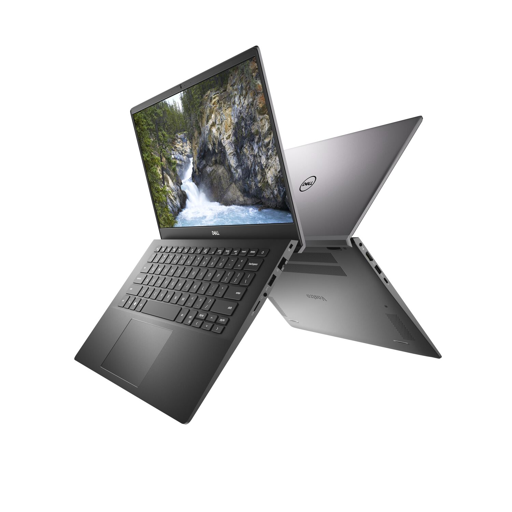
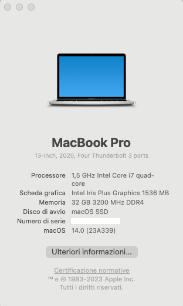
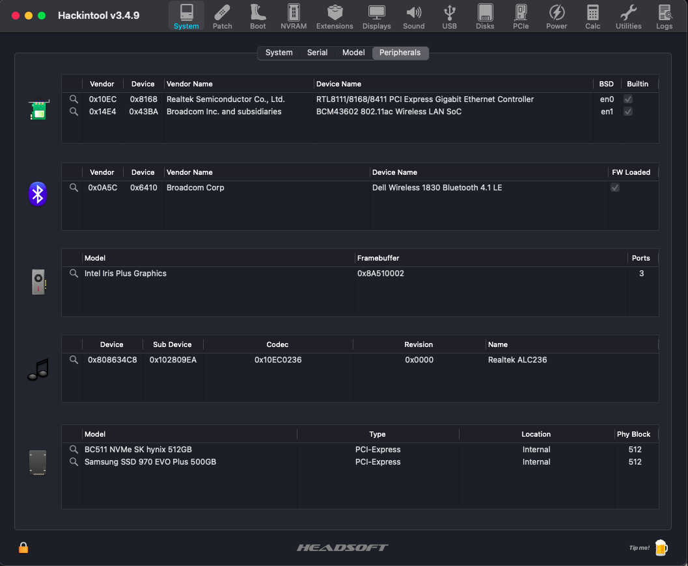
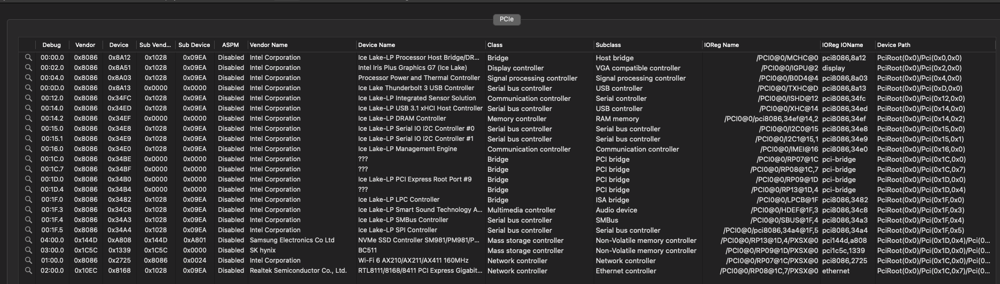
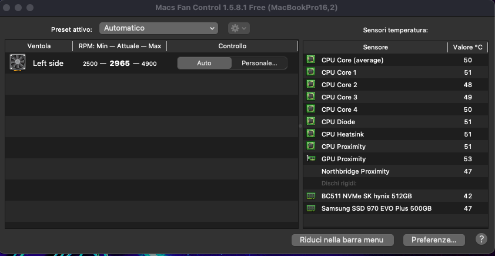
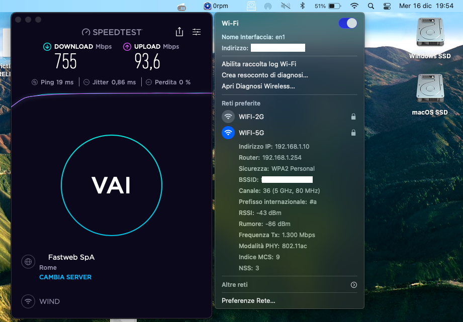
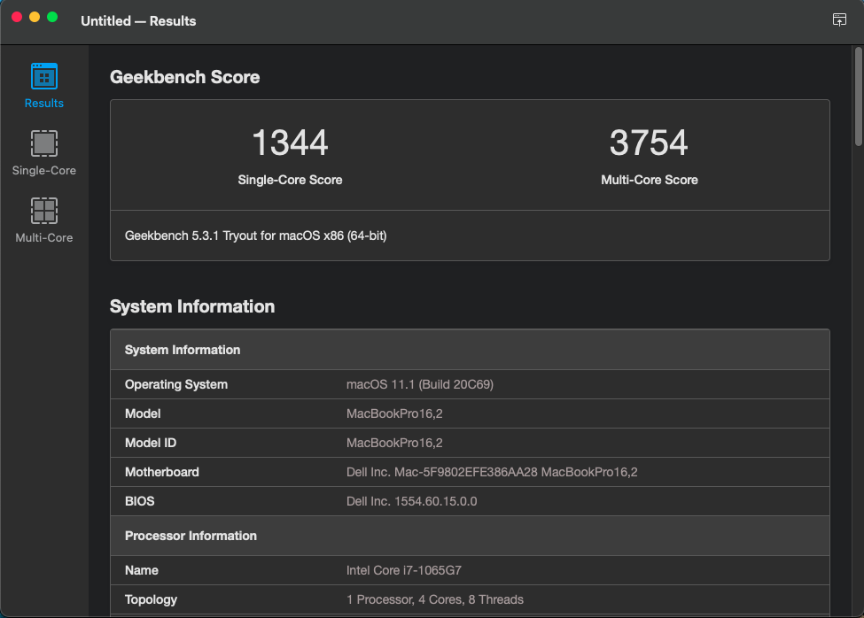
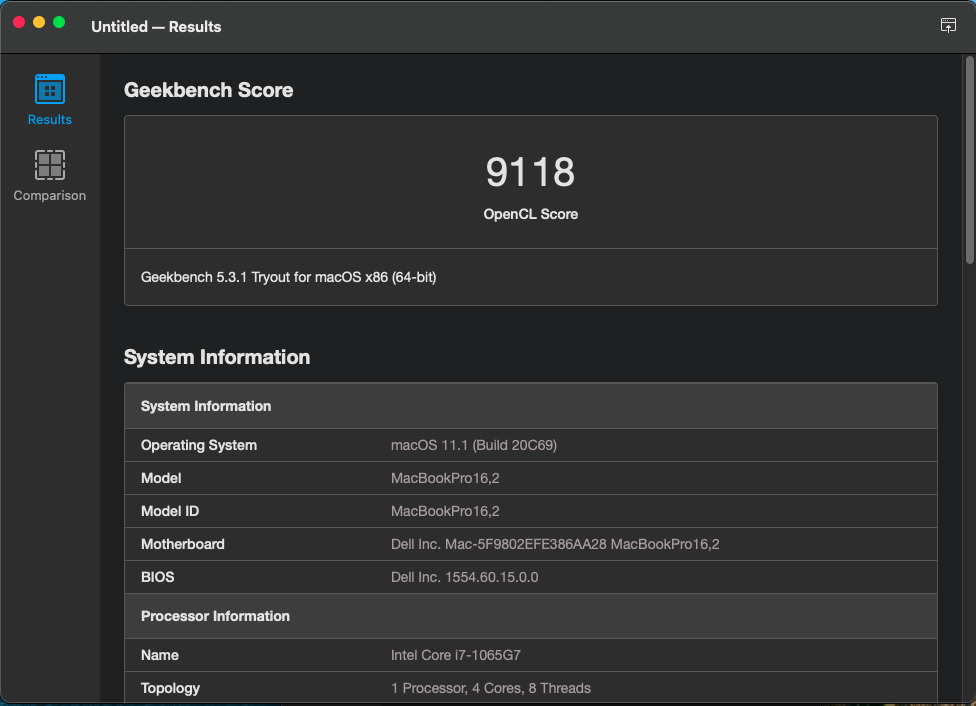
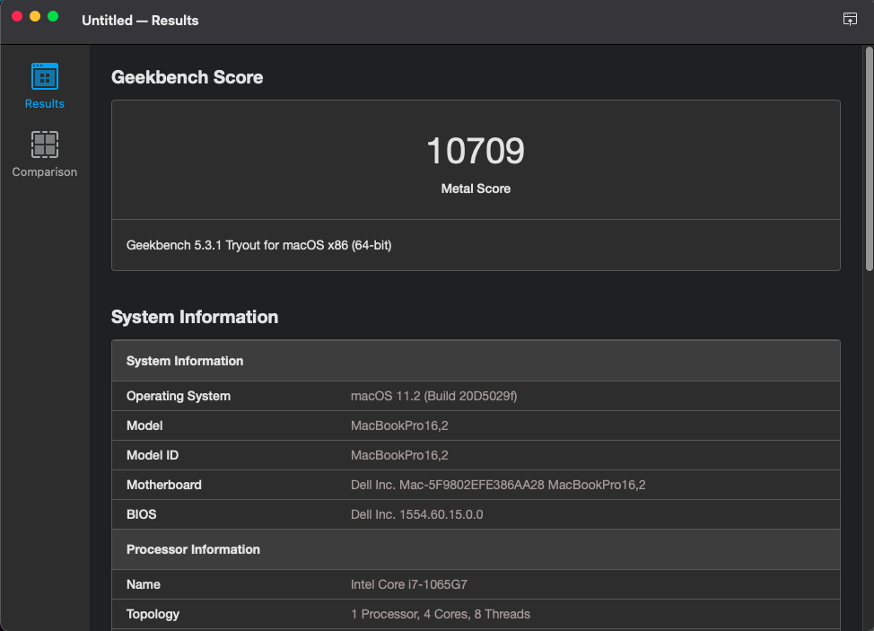
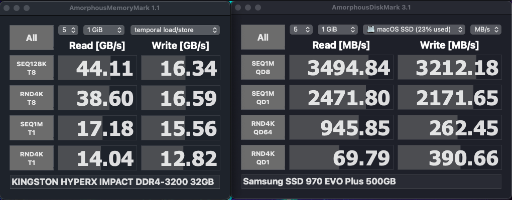

# Dell Vostro 5401 (Ice Lake) Hackintosh

EFI for Dell Vostro 5401 with OpenCore bootloader

### Computer Spec:

| Component        | Brank                              |
| ---------------- | ---------------------------------- |
| CPU              | Intel i7 1065G7 (4C-8T 8MB ICL)    |
| iGPU             | Intel® Iris Plus Graphics          |
| Lan              | Realtek 8168                       |
| Audio            | Realtek ALC236                     |
| Ram              | 32 Gb DDR4 3200 Mhz                |
| Wifi + Bluetooth | BCM943602BAED (DW1830)             |
| NVMe             | HYNIX BC511 512 GB (WINDOWS)       |
| NVME             | SAMSUNG 970 EVO PLUS 500 GB (MACOS)|
| SmBios           | MacBookPro 16,2                    |
| BootLoader       | OpenCore                           |

### What works and What doesn't or WIP:

- [x] Intel Iris Plus iGPU eDP with Backlight Output
- [ ] Intel Iris Plus iGPU HDMI Output (Not supported at the moment)
- [ ] Intel Iris Plus iGPU Type-C to HDMI Output (Not supported at the moment)
- [x] ALC236 Internal Speakers
- [x] ALC236 Internal microphone
- [x] ALC236 Combojack headphones
- [ ] ALC236 Combojack microphone
- [ ] ALC236 HDMI Audio Output (Not supported at the moment)
- [ ] ALC236 TYPE-C to HDMI Audio Output (Not supported at the moment)
- [x] All USB-A 3.1 Ports (TYPE-C 3.2 Included)
- [x] SpeedStep / Sleep / Wake
- [x] HID Key PWRB & SLPB 
- [x] I2C Touchpad with gesture (Partial work)
- [x] Keyboard (PS2-Internal) with backlight
- [x] F6 & F7 Brightness Key
- [x] F10 Print Screen Key
- [x] F1 & F2 & F3 Sound Key
- [x] Wi-Fi and Bluetooth BCM943602BAED (DW1830) Module
- [x] Realtek RTL8168 LAN
- [x] SSD NVME Slot-1 PciE Gen3x4
- [x] SSD NVME Slot-2 PciE Gen3x4 
- [x] Micro SD Cardreader (USB-Internal)
- [x] WebCam (USB-Internal)
- [x] All Sensors CPU, IGPU, BATTERY, NVME, FAN
- [x] ACPI Battery
- [x] NVRAM (Native)
- [x] Recovery (macOS) boot from OpenCore
- [x] Windows 10 boot from OpenCore

## Peripherals & Benchmarks

### Special Config:

- Usb port mapping performed
- SSDT-Hack Essential patch
- Applied cosmetics PCI Dev

See [ioreg](./ioreg%20MacBook%20Pro%2016%2C2.ioreg) for more clarification

## Bios settings
### Enable :
* SATA Operation : AHCI
* Fastboot : Thorough

### Disable : 
* Secure Boot
* TPM2.0 Security On
* Intel SGX
* Wake on AC
* Wake on Dell USB-C Dock
* Power On Lid Open 
* Sign Of Life : Early Logo Display / Early keyboard backlight
* VT for Direct I/O
* cfg lock : DO AT YOUR OWN RISK!!! It may brick your laptop.
 `CFG Lock` to `0x0` using `setup_var 0x43 0x00`

## Credits

- [Apple](https://apple.com) for macOS.
- [Acidanthera](https://github.com/acidanthera) for OpenCore and all the lovely hackintosh work.
- [Dortania](https://dortania.github.io/OpenCore-Install-Guide/config-laptop.plist/icelake.html) For great and detailed guides.
- [Hackintoshlifeit](https://github.com/Hackintoshlifeit) Support group for installation and post installation.

# If you need help please contact us on [Telegram](https://t.me/HackintoshLife_it) or [Web](https://www.hackintoshlife.it/)
