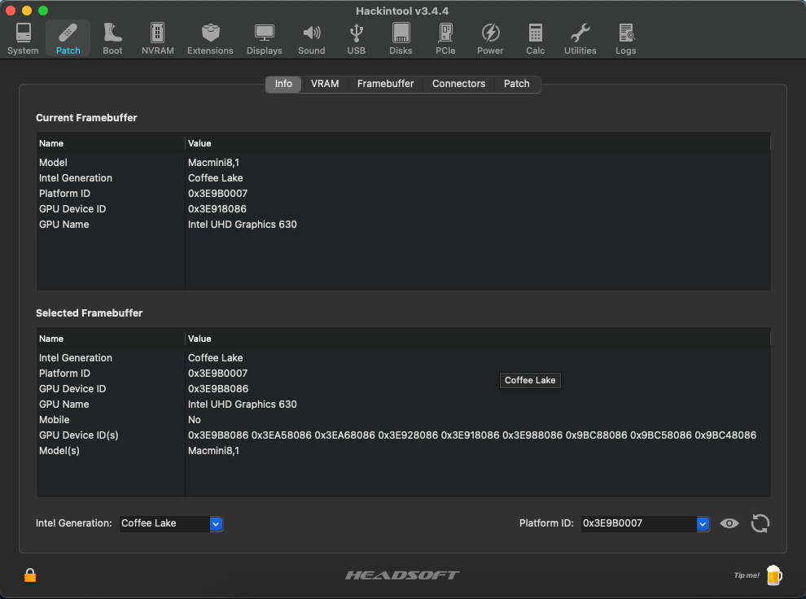
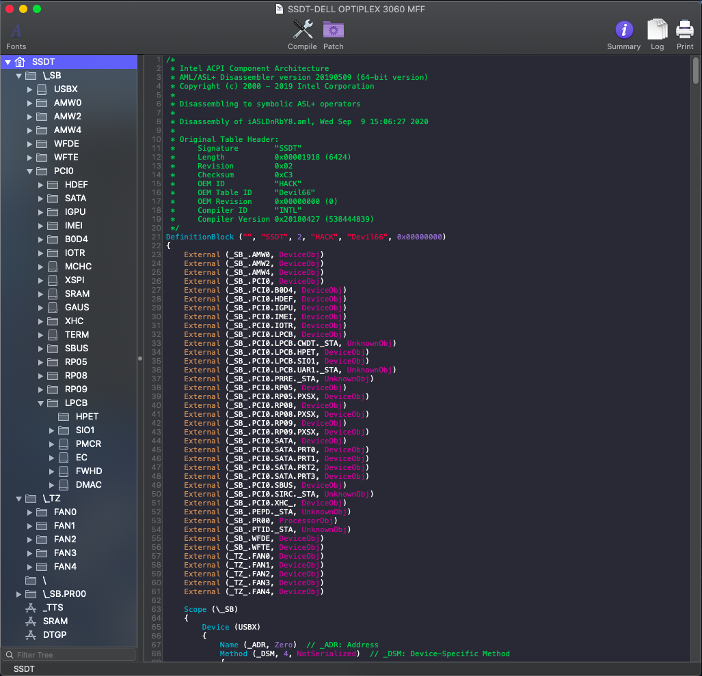

# Dell Vostro 5401 (Ice Lake) Hackintosh

EFI for Dell Vostro 5401 with OpenCore bootloader

### Computer Spec:

| Component        | Brank                              |
| ---------------- | ---------------------------------- |
| CPU              | Intel i7 1065G7                    |
| iGPU             | Intel® Iris Plus Graphics          |
| Lan              | Realtek 8168                       |
| Audio            | Realtek ALC236                     |
| Ram              | 8 Gb DDR4 3200 Mhz                 |
| Wifi + Bluetooth | BCM943602BAED                      |
| NVMe             | HYNIX BC511 512 Gb                 |
| NVME             | SAMSUNG 970 EVO PLUS 500 Gb        |
| SmBios           | MacBookPro 16,2                    |
| BootLoader       | OpenCore                           |

## Peripherals

### What works and What doesn't or WIP:

- [x] Intel UHD 630 iGPU HDMI/DP Output
- [x] ALC255 Internal Speakers
- [x] ALC255 Native Combojack headphones
- [x] ALC255 HDMI/DP Audio Output
- [x] All USB Ports 
- [x] SpeedStep / Sleep / Wake
- [x] Wi-Fi and Bluetooth BCM943602BAED (DW1830) Module
- [x] Realtek RTL8168 LAN
- [x] NVRAM
- [x] Windows boot from OpenCore
- [x] ALC255 Combojack microphone
- [x] ALC255 jack LINE-IN

### Special Config:

- Usb port mapping performed
- Disabled unused device
- Applied cosmetics DSM

### Post Install:

Open terminal and run install.sh from PostInsall/ComboJackAlc295. After reboot insert jack and appears this image

### SSDT Info

See [ioreg](./ioregmacbook.ioreg) for more clarification

## Credits

- [Apple](https://apple.com) for macOS;
- [Acidanthera](https://github.com/acidanthera) for OpenCore and all the lovely hackintosh work.
- [Dortania](https://github.com/dortania)
- [mald0n](https://github.com/MaLd0n)
- [rehabman](https://github.com/RehabMan)
- [daliansky](https://github.com/daliansky)
- [Hackintoshlifeit](https://github.com/Hackintoshlifeit)

# If you need help please contact us on [Telegram](https://t.me/HackintoshLife_it) or [Web](https://www.hackintoshlife.it/)
